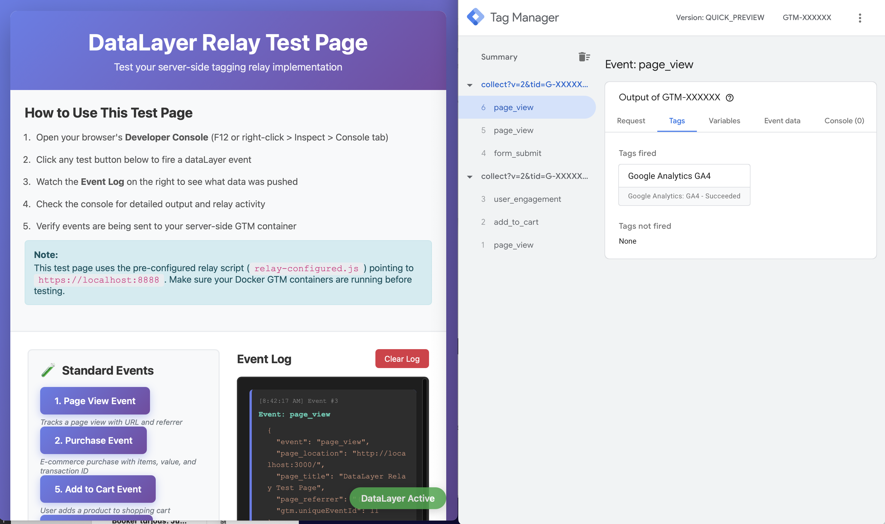

# DataLayer Relay for Server-Side Tagging

A lightweight JavaScript library that intercepts dataLayer events and forwards them to a server-side GTM container. This can be used when moving complex applications to server side tagging while moving away from web tagging containers.



---

## Overview

### What is This Project?

DataLayer Relay is a client-side script that sends all datalayer events to server side tagging. It bundles custom variables to one json object so it can be used for server side tags.

This repository provides:
- **Template-based relay script** (`src/datalayer-relay.js`) with environment variable substitution. This can be used as base for the integration.
- **Complete Docker stack** for local development and testing.
- **Test environment** to verify your GTM configuration

---

## Quick Start

### 1. Configure Environment Variables

```bash
# Copy the example environment file
cp .env.example .env

# Edit with your actual values
nano .env
```

Set the following in `.env`:

```bash
# Get this from GTM Admin > Container Settings
CONTAINER_CONFIG=your_container_config_here

# Your GA4 Measurement ID (e.g., G-ABC123XYZ)
GA4_PROPERTY=G-XXXXXXXXXX
```

### 2. Start the Stack

SSL certificates are **automatically generated**. Just run:

```bash
docker-compose up -d
```

This starts:
- GTM Preview Server (for debugging)
- GTM Live Server (for production simulation)
- Nginx HTTPS Proxy (ports 8888, 8889)
- Template Server (port 3000) - serves your test site with dynamic config

### 3. Test It

```bash
# Check all containers are healthy
docker-compose ps

# Verify GTM containers
curl -k https://localhost:8888/healthy  # Live server
curl -k https://localhost:8889/healthy  # Preview server

# Open test site
open http://localhost:3000
```

### 4. Add localhost to your server side container

Add https://localhost:8888 to your server side container sites. Now you can preview and debug a server side container without server setup.

**That's it!** Click the test buttons and watch events flow through your server-side GTM container.

---

## Architecture

The system consists of 5 Docker services:

```
┌─────────────────────────────────────────────┐
│  Browser                                    │
│  ├─> http://localhost:3000 (Test Site)     │
│  ├─> https://localhost:8888 (GTM Live)     │
│  └─> https://localhost:8889 (GTM Preview)  │
└─────────────────────────────────────────────┘
              ↓
┌─────────────────────────────────────────────┐
│  ssl-init (one-time)                        │
│  └─> Generates SSL certificates            │
└─────────────────────────────────────────────┘
              ↓
┌─────────────────────────────────────────────┐
│  template-server (Node.js)                  │
│  ├─> Serves test site (port 3000)          │
│  └─> Injects GA4_PROPERTY & URL at runtime │
└─────────────────────────────────────────────┘
              ↓
┌─────────────────────────────────────────────┐
│  nginx (HTTPS Proxy)                        │
│  ├─> Port 8888 → gtm-live                  │
│  └─> Port 8889 → gtm-preview               │
└─────────────────────────────────────────────┘
              ↓
┌──────────────────┐    ┌─────────────────────┐
│  gtm-live        │───→│  gtm-preview        │
│  (Production)    │    │  (Debug Mode)       │
└──────────────────┘    └─────────────────────┘
```

### Service Details

| Service | Container | Ports | Purpose |
|---------|-----------|-------|---------|
| ssl-init | ssl-init | - | Generates SSL certificates (runs once) |
| gtm-preview | gtm-preview | Internal:8080 | GTM Preview Server |
| gtm-live | gtm-live | Internal:8080 | GTM Live Server |
| nginx | gtm-nginx | 8888, 8889 | HTTPS Proxy for GTM |
| template-server | template-server | 3000 | Test site + dynamic config |

---

## How It Works

### Template Substitution

The template server (`server.js`) dynamically injects environment variables into JavaScript and HTML files:

**Before (in `src/datalayer-relay.js`):**
```javascript
var MEASUREMENT_ID = '{{GA4_PROPERTY}}';
var SERVER_CONTAINER_URL = '{{SERVER_CONTAINER_URL}}';
```

**After (served to browser):**
```javascript
var MEASUREMENT_ID = 'G-ABC123XYZ';
var SERVER_CONTAINER_URL = 'https://localhost:8888';
```

### Files with Template Substitution

- `src/datalayer-relay.js` - Relay script with placeholders
- `test-site/index.html` - Test page (if needed)

### Available Placeholders

- `{{GA4_PROPERTY}}` - Your GA4 Measurement ID
- `{{SERVER_CONTAINER_URL}}` - Your GTM server container URL

---

## Configuration

### Environment Variables

#### Required

- **`CONTAINER_CONFIG`** - Base64-encoded GTM container configuration
  - Get from: GTM Admin > Container Settings > Container Config
  - Format: Base64 string

- **`GA4_PROPERTY`** - Your GA4 Measurement ID
  - Format: `G-XXXXXXXXXX`
  - Get from: Google Analytics > Admin > Data Streams

#### Optional

- **`SERVER_CONTAINER_URL`** - GTM server container URL
  - Default: `https://localhost:8888`
  - Change for production deployment

- **`PORT`** - Template server port
  - Default: `3000`

### Example .env File

```bash
# GTM Configuration
CONTAINER_CONFIG=aWQ9R1RNLVdSOUo0NTROJmVudj0xJmF1dGg9bnRMejlYRHhVU1RBd1VaOHdSb3N2dw==

# GA4 Property
GA4_PROPERTY=G-2JEHB71L3G

# Server URL (optional)
SERVER_CONTAINER_URL=https://localhost:8888
```

---

## Advanced Features

### DataLayer Field Persistence

The relay script supports **persistent fields** - parameters that, once set, are automatically included in all subsequent events until they're updated or the page is reloaded.

#### How It Works

1. You define which fields should persist by editing the `PERSISTENT_FIELDS` array in `src/datalayer-relay.js`
2. When an event sets one of these fields, the value is stored in memory
3. All subsequent events automatically include the last known value of each persistent field
4. If a new event provides a different value for a persistent field, it updates the stored value

#### Example Use Case

```javascript
// In src/datalayer-relay.js, configure persistent fields:
var PERSISTENT_FIELDS = ['user_type', 'subscription_tier', 'session_id'];
```

```javascript
// Event 1: User logs in
dataLayer.push({
  event: 'login',
  user_type: 'premium',
  subscription_tier: 'gold'
});

// Event 2: Page view (no user fields specified)
dataLayer.push({
  event: 'page_view',
  page_title: 'Dashboard'
});
// → Automatically includes user_type='premium' and subscription_tier='gold'

// Event 3: Subscription upgraded
dataLayer.push({
  event: 'subscription_change',
  subscription_tier: 'platinum'  // Updates the persistent value
});

// Event 4: Purchase
dataLayer.push({
  event: 'purchase',
  transaction_id: 'T123',
  value: 99.99
});
// → Automatically includes user_type='premium' and subscription_tier='platinum'
```

#### Configuration

Edit the `PERSISTENT_FIELDS` array in `src/datalayer-relay.js` (around line 65):

```javascript
// Default (no persistence)
var PERSISTENT_FIELDS = [];

// Example with persistence enabled
var PERSISTENT_FIELDS = ['user_type', 'subscription_tier', 'session_id', 'user_id'];
```

#### Important Notes

- **Session Scope**: Persistent values are stored in memory and reset on page reload
- **Precedence**: If an event explicitly sets a persistent field, that value takes precedence and updates the stored value
- **No Storage**: Values are NOT saved to localStorage or cookies - they exist only during the current page session
- **Debug Mode**: When `DEBUG = true`, you'll see `[Persistence] Updated field_name = value` logs in the console

---

## Testing

### Using the Test Site

1. **Start the stack**: `docker-compose up -d`
2. **Open test site**: http://localhost:3000
3. **Open DevTools**: Press F12 or right-click > Inspect
4. **Fire events**: Click any test button
5. **Verify**:
   - Check browser Console for relay logs
   - Check Network tab for requests to `localhost:8888`
   - View Event Log on the page
   - Use GTM Debug Mode to see events in GTM

### Test Scenarios Included

The test site provides 6 event scenarios:

1. **Page View** - Basic page view tracking
2. **Purchase** - E-commerce purchase with items
3. **Form Submit** - Custom form submission event
4. **Custom Interaction** - Mixed standard + custom parameters
5. **Add to Cart** - E-commerce add to cart
6. **User Login** - Authentication event

---

## Troubleshooting

### Containers Not Starting

```bash
# Check container status
docker-compose ps

# View logs for specific service
docker-compose logs gtm-live
docker-compose logs gtm-preview
docker-compose logs template-server
docker-compose logs nginx
docker-compose logs ssl-init

# Check all logs
docker-compose logs -f
```

### SSL Certificate Issues

SSL certificates are automatically generated. If there are issues:

```bash
# Manually regenerate certificates
./generate-ssl.sh

# Check if certificates exist
ls -la ssl/

# Remove and regenerate
rm -rf ssl/
docker-compose up -d
```

### Template Variables Not Substituting

```bash
# Check if environment variables are loaded
docker exec template-server env | grep GA4_PROPERTY
docker exec template-server env | grep SERVER_CONTAINER_URL

# Ensure you're accessing via http://localhost:3000 (not file://)
# Browser must load through the template server for substitution to work
```

### GTM Container Configuration Issues

```bash
# Verify CONTAINER_CONFIG is set
docker exec gtm-live env | grep CONTAINER_CONFIG
docker exec gtm-preview env | grep CONTAINER_CONFIG

# If empty, check your .env file
cat .env

# Restart containers after .env changes
docker-compose restart
```

### Port Already in Use

```bash
# Find what's using port 3000
lsof -i :3000

# Kill the process (replace PID)
kill -9 <PID>

# Or change the port in .env
echo "PORT=3001" >> .env
docker-compose up -d
```

### HTTPS Browser Warnings

Self-signed certificates will show browser warnings. This is normal for local development.

**Chrome**: Click "Advanced" → "Proceed to localhost (unsafe)"
**Firefox**: Click "Advanced" → "Accept the Risk and Continue"
**Safari**: Click "Show Details" → "visit this website"

### Reset Everything

```bash
# Stop and remove all containers
docker-compose down

# Remove everything including images
docker-compose down --rmi all --volumes

# Remove SSL certificates
rm -rf ssl/

# Start fresh
docker-compose up -d --build
```

---

## License

MIT License - feel free to use this in your projects!
